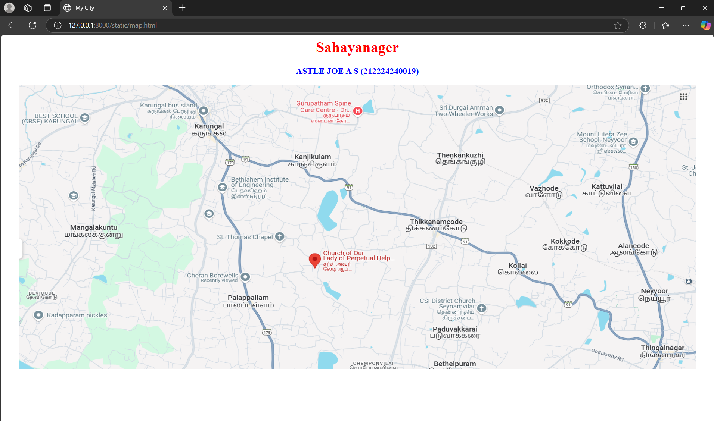
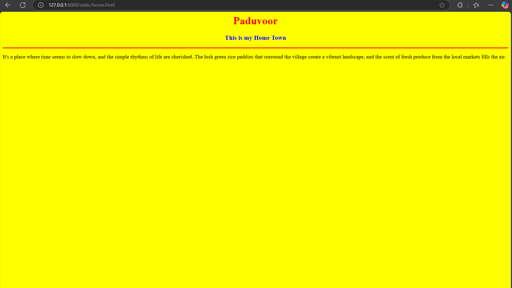
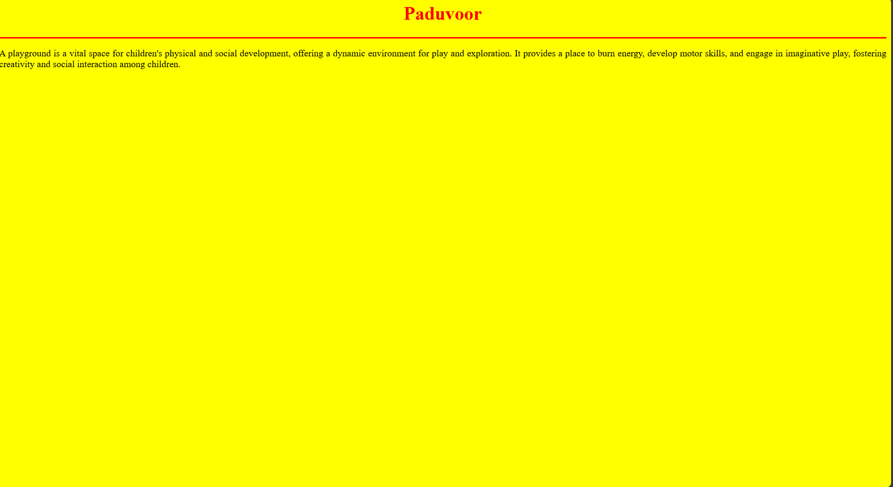
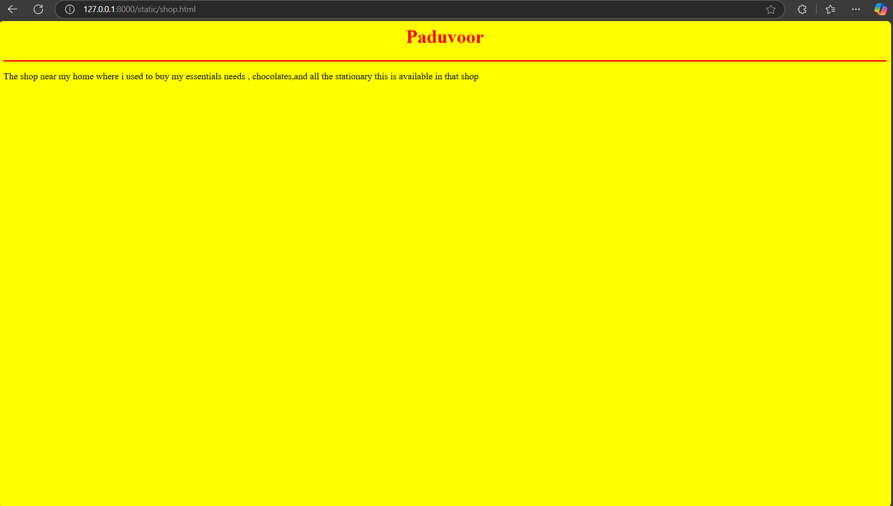
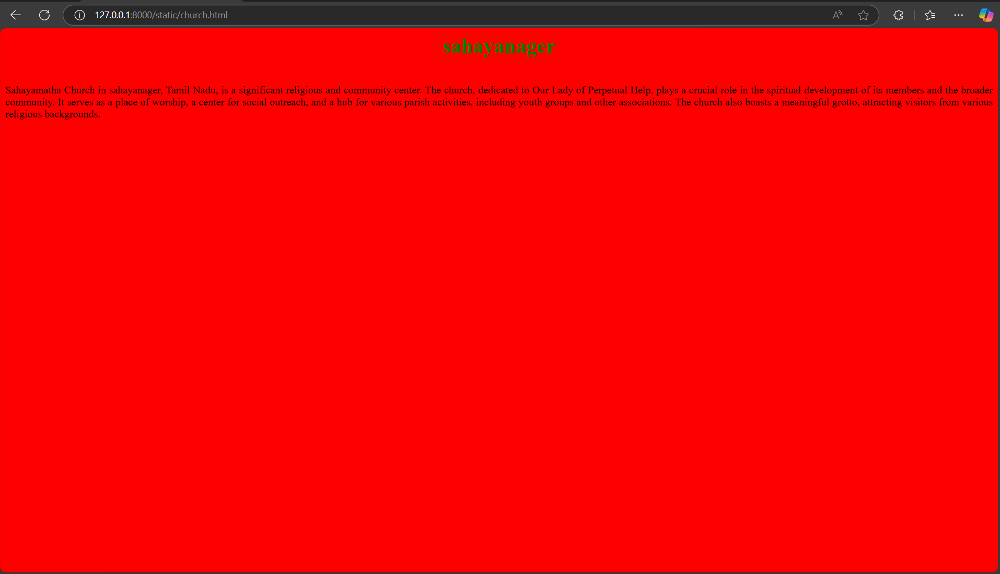
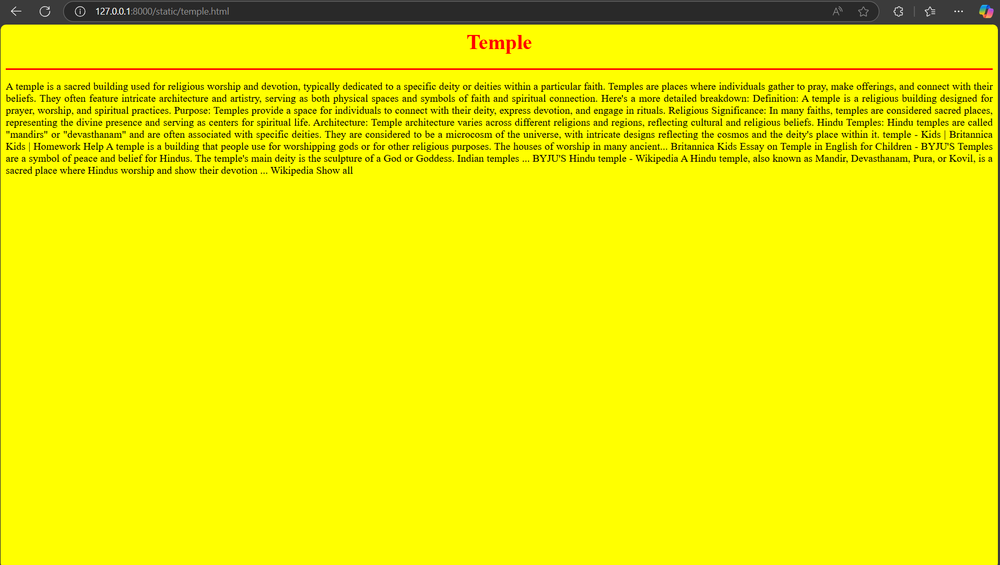

# Ex04 Places Around Me
## Date: 30/04/2025
## AIM
To develop a website to display details about the places around my house.

## DESIGN STEPS

### STEP 1
Create a Django admin interface.

### STEP 2
Download your city map from Google.

### STEP 3
Using ```<map>``` tag name the map.

### STEP 4
Create clickable regions in the image using ```<area>``` tag.

### STEP 5
Write HTML programs for all the regions identified.

### STEP 6
Execute the programs and publish them.

## CODE
map.html:
```
<html>
<head>
<title>My City</title>
</head>
<body>
 <h1 align="center">
    <font color="red"><b>Sahayanager</b></font>
 </h1>
 <h3 align="center">
    <font color="blue"><b>ASTLE JOE A S (212224240019)</b></font>
 </h3>
 <center>
    
    <map name="Mycity">
        <area shape="rect" coords="400,250,300,300" href="home.html" title="My Home Town">
        <area shape="rect" coords="900,300,500,400" href="church.html" title="My church">
        <area shape="rect" coords="600,600,750,750" href="shop.html" title="Nearby shop">
        <area shape="rect" coords="800,250,850,400" href="temple.html" title="Nearby temple ">
        <area shape="rect" coords="1000,100,900,500" href="ground.html" title="playground">
    </map>
 </center>
</body>
</html>
```
home.html:
```
html>
    <head>
        <title>My Home</title>
    </head>
    <body bgcolor="yellow">
        <h1 align="center">
            <font color="red"><b>Paduvoor</b></font>
        </h1>
        <h3 align="center">
            <font color="green"><b>This is my Home Town</b></font>
        </h3>
        <hr size="3" color="red">
        <p align="justify">
            <font face="Home " size="5"></font>
            It's a place where time seems to slow down, and the simple rhythms of life are cherished. 
            The lush green rice paddies that surround the village create a vibrant landscape, 
            and the scent of fresh produce from the local markets fills the air.
        </p>
    </body>
</html>
```
church.html
```
<html>
    <head>
        <title>Church</title>
    </head>
    <body bgcolor="red">
        <h1 align="center">
            <font color="green"><b>sahayanager</b></font>
        </h1>
        <h3 align="center">
            <font color="blue"><b></b></font>
        </h3>
        <hr size="3" color="red">
        <p align="justify">
            <font face="Home " size="5"></font>
            Sahayamatha Church in sahayanager, Tamil Nadu, is a significant religious and community center. 
            The church, dedicated to Our Lady of Perpetual Help, plays a crucial role in the spiritual development of its members and the broader community. It serves as a place of worship, a center for social outreach, and a hub for various parish activities, including youth groups and other associations. 
            The church also boasts a meaningful grotto, attracting visitors from various religious backgrounds. 
        </p>
    </body>
</html>
```
shop.html:
```
<html>
    <head>
        <title>Shop</title>
    </head>
    <body bgcolor="yellow">
        <h1 align="center">
            <font color="red"><b>Paduvoor</b></font>
        </h1>
        <h3 align="center">
            <font color="blue"><b></b></font>
        </h3>
        <hr size="3" color="red">
        <p align="justify">
            <font face="Home " size="5"></font>
            The shop near my home 
            where i used to buy my essentials needs ,
            chocolates,and all the stationary this is available in that shop
        </p>
    </body>
</html>
```
temple.html:
```
<html>
    <head>
        <title>Temple</title>
    </head>
    <body bgcolor="yellow">
        <h1 align="center">
            <font color="red"><b>Temple</b></font>
        </h1>
        <h3 align="center">
            <font color="blue"><b></b></font>
        </h3>
        <hr size="3" color="red">
        <p align="justify">
            <font face="Home " size="5"></font>
            A temple is a sacred building used for religious worship and devotion, typically dedicated to a specific deity or deities within a particular faith. Temples are places where individuals gather to pray, make offerings, and connect with their beliefs. They often feature intricate architecture and artistry, serving as both physical spaces and symbols of faith and spiritual connection. 
            Here's a more detailed breakdown:
            Definition:
            A temple is a religious building designed for prayer, worship, and spiritual practices. 
            Purpose:
            Temples provide a space for individuals to connect with their deity, express devotion, and engage in rituals. 
            Religious Significance:
            In many faiths, temples are considered sacred places, representing the divine presence and serving as centers for spiritual life. 
            Architecture:
            Temple architecture varies across different religions and regions, reflecting cultural and religious beliefs. 
            Hindu Temples:
            Hindu temples are called "mandirs" or "devasthanam" and are often associated with specific deities. They are considered to be a microcosm of the universe, with intricate designs reflecting the cosmos and the deity's place within it. 
            temple - Kids | Britannica Kids | Homework Help
            A temple is a building that people use for worshipping gods or for other religious purposes. The houses of worship in many ancient...
            
            Britannica Kids
            
            Essay on Temple in English for Children - BYJU'S
            Temples are a symbol of peace and belief for Hindus. The temple's main deity is the sculpture of a God or Goddess. Indian temples ...
            
            BYJU'S
            Hindu temple - Wikipedia
            A Hindu temple, also known as Mandir, Devasthanam, Pura, or Kovil, is a sacred place where Hindus worship and show their devotion ...
            
            Wikipedia
            
            Show all
              
        </p>
    </body>
</html>
```
ground.html:
```
<html>
    <head>
        <title>Play ground</title>
    </head>
    <body bgcolor="yellow">
        <h1 align="center">
            <font color="red"><b>Paduvoor</b></font>
        </h1>
        <h3 align="center">
            <font color="blue"><b></b></font>
        </h3>
        <hr size="3" color="red">
        <p align="justify">
            <font face="Home " size="5"></font>
            A playground is a vital space for children's physical and social development, 
            offering a dynamic environment for play and exploration. 
            It provides a place to burn energy, develop motor skills, and engage in imaginative play, fostering creativity and social interaction among children. 
        </p>
    </body>
</html>
```


## OUTPUT

### map.html:

### home.html:

### ground.html:

### shop.html:

### church.html:

### temple.html:



## RESULT
The program for implementing image maps using HTML is executed successfully.
